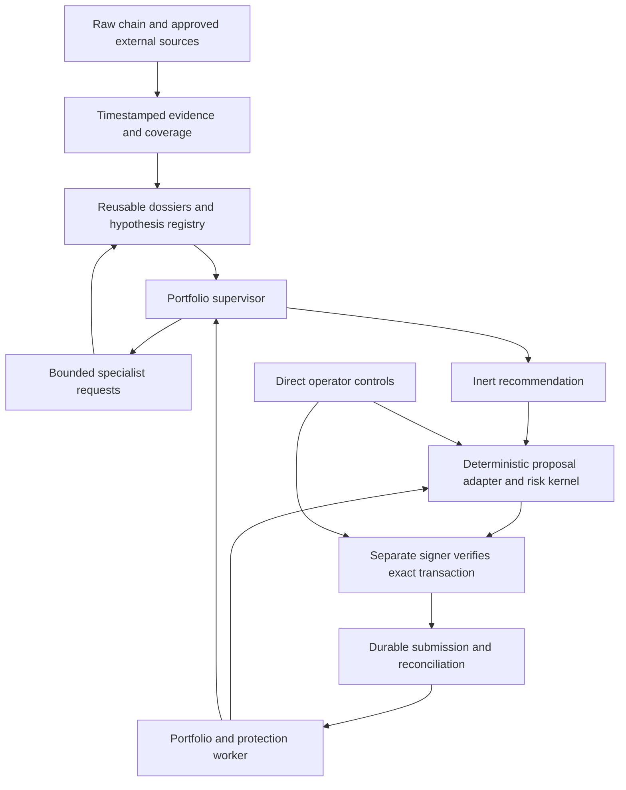

<!-- SPDX-License-Identifier: Apache-2.0 -->
# Design 0017 — A private autonomous trader

**Status:** researched architecture recommendation and implementation handoff;
owner direction recorded, implementation and economic results still unproved.
**Date:** 2026-09-09.
**Inspected baseline:** `c39aabc8aafc3fcb9da2b0bf0c1329a18f75a212`.
**Build sequence:** [plan 0011](../plans/0011-private-autonomous-trader.md).
**Preceding work:** [research 0032](../research/0032-an-advanced-assistant-worth-buying-again.md)
and [design 0016](0016-free-to-use-and-metered-intelligence.md).

## 1. The recommendation and the owner's decision

**Build the private autonomous trader. Give it a strong research capability,
one portfolio decision owner, and a bounded fleet of specialists when they earn
their cost. Use it with Josh's own capital only after the execution and experiment
gates below. Improve it privately; evaluate a paid service after that.** Research
credits are an optional eventual offer, not the prerequisite or purpose of this
build. A better autonomous trader could be the more valuable recurring product.

Josh has decided the direction: build, privately use, measure and improve a trader
before selling it; cover the Solana market, including SOL- and USDC-quoted meme
coins beyond pump.fun; retain useful free tools and previously purchased research.
This document recommends the architecture and experiments to pursue that decision.
It does not record that Josh has approved a wallet, deposit, loss budget, provider
purchase, live deployment or customer launch.

The current deterministic instrument's **0 bps selection edge** is a dated result,
not a test of this proposed AI. The approximately **456 bps**, and **850 bps above
roughly $59**, come from the measured pump.fun configuration in
[0017](../research/0017-a-control-that-could-have-been-traded.md) and
[0022](../research/0022-capacity-was-a-budget-not-a-ceiling.md).
They are neither universal Solana costs nor an estimate of future AI performance.
[0024](../research/0024-the-spike-became-a-hump-and-the-signal-moved.md)
also shows why a launch-structure observation needs a cohort and date. Public
claims remain bounded by measurements; private research may seek new edge.

There are two explicit departures from earlier sequencing. Research 0032's
research-sales-first recommendation is superseded for this project. The
[GOAL](../../GOAL.md) paragraph delaying venue expansion until an edge exists
is superseded **for this private experiment** by Josh's Solana-wide instruction.
The economic hurdle must be measured for each executable strategy and venue.
This document records those conflicts; it does not silently rewrite GOAL or
change the shipped `Policy::CLOSED`.

There is a credible product hypothesis here, **not yet a demonstrated trading
business**. The decisive question is whether this system makes better net
portfolio decisions than cheaper alternatives, repeatedly, at useful capital
sizes. A polished fleet demonstration or one profitable weekend cannot answer it.

## 2. What the assistant should actually do

One conversation controls one coherent trading operation. The operator gives a
mandate: allowed capital, instruments, holding horizons, position and loss limits,
research spend, session duration and wake-up conditions. Missing money settings
deny live operation. The assistant investigates opportunities, asks for missing
evidence, proposes entries and reductions, monitors positions, and explains every
decision. Permission still comes from deterministic policy and the separate signer.

The following are **target behaviours and illustrative screenshot sentences**,
not statements about current capabilities or example performance results.

| Capability | Evidence and collection cost | Claim and refusal | Sentence worth keeping |
|---|---|---|---|
| Continuous opportunity research | Existing launch/creator/structure records; new cross-venue pools, raw trades, account state and timestamped quotes. Shared raw RPC/stream subscription, local decoding, storage, targeted model calls; social reads separately budgeted. | Finds and compares candidates under a recorded hypothesis. Does not call a cluster a cabal or a forecast demonstrated edge. | “I checked the funders, current liquidity and an exit at your size; the remaining uncertainty is whether this flow persists.” |
| Portfolio-level autonomous decisions | New reconciled wallet inventory, reservations, valuations, strategy state, current risk inputs and retained dossiers. Event-driven inference plus live RPC and journal writes. | Proposes buys, holds and reductions under one capital budget. Does not guarantee profitable trades or independent bets merely because mints differ. | “These three tokens share the same exposure; I used one risk budget for all three.” |
| Overnight position protection | New durable position lifecycle, exit routes, signer authority, fee reserve and reconciliation. Hosting, fresh data, simulation, network/provider signing costs continue even without model calls. | Attempts predefined protective actions while authority, network, data and liquidity permit. Does not promise an executable stop price or operation through every outage. | “New entries are paused; the authorised exit monitor is still running, and these two positions currently have usable exit routes.” |
| Decision and execution autopsy | Existing reason codes and journal; new complete decision inputs, intent/signature trail, actual balance deltas and costs. Mostly stored-data computation; model explanation optional. | Separates selection, timing, sizing, execution and missing evidence. Does not attribute all profit to reasoning or pretend replay fills were real. | “The thesis was directionally right; the actual fill and exit costs consumed the gain.” |
| Research that improves future decisions | Hypothesis registry, all attempted variants, point-in-time evidence and later outcomes. Bounded offline jobs, prospective recording and evaluation; no automatic production self-editing. | Proposes a reusable feature and tests its incremental value before promotion. Does not let a persuasive report change live policy. | “This investigation suggested a cheaper signal; it is a candidate experiment, not part of the live strategy.” |

The last capability extends the initial research-credit proposal: **research can
produce reusable, tested decision features**, not just reports for the next chat.
A costly investigation might teach a cheap future check. Save the original
hypothesis, counterexample and failed experiments as well as the successful
feature. This is a recommendation not previously stated in Josh's brief, not a
claim to know every idea the owner has considered.

Morning review should show starting and ending equity, realised and unrealised
results, all costs, benchmark comparison, open risk, missed opportunities,
abstentions, outages and required actions. Profit cannot conceal an unknown
position or a failed protection worker. A no-trade night can be correct; it does
not establish the value of a paid autonomous trader by itself.

## 3. Solana-wide means an explicit market capability map

The target is **Solana spot markets as a whole**, not an expanded pump.fun filter.
Use mint addresses and pool/program identities, never tickers, as keys. SOL, wrapped
SOL and USDC are distinct accounting assets; other SPL and Token-2022 assets can be
admitted by supported semantics. USDC is a token, not a separate chain or venue.
Perpetuals, borrowing, shorting, bridging and LP management would be additional
products with different accounting and permission requirements; they are not
implied by broad spot access.

| Market family in the target inventory | Work required beyond discovering its name |
|---|---|
| pump.fun curves and PumpSwap | Capture both phases and migration identity; verify current instructions and fee behaviour from accepted transactions.[^1] |
| Raydium AMM v4, CPMM, CLMM and LaunchLab | Distinct pool models, fee/state decoders and migration handling; concentrated liquidity cannot inherit a bonding-curve capacity formula.[^2] |
| Orca Whirlpools | Tick/range state, quotes, route semantics and exit simulation for concentrated liquidity.[^3] |
| Meteora DLMM, DAMM v2, Dynamic Bonding Curve and relevant legacy pools | Bin/dynamic-fee versus pool/curve models, migration and route validation; avoid treating every Meteora product as the same swap.[^4] |
| Jupiter routes across supported venues | Route discovery and comparison; exact instruction/account validation for each admitted path. Routing is not a chain-wide historical index.[^5] |
| Other existing and newly deployed Solana markets | Registry discovery with explicit unsupported/unknown states, prioritised adapter work and an upgrade watch. A listed program is not automatically approved to move money. |

Every pool progresses through **discovered → observed → decoded → quoted →
round-trip verified → live admitted**, with timestamps, program version and a
reason for stopping. The first shadow cohort must include multiple pool families
and both SOL and USDC routes. Broader discovery starts immediately; complete live
support is delivered through validated adapters. Show the coverage denominator
against the registry and explain its own discovery gaps. Do not advertise literal
100% coverage from an aggregator's route list.

Buying every historical Solana transaction is not necessary to begin. Maintain a
broad discovery index, then record targeted cohorts and active portfolios in depth.
Record the filter and exclusions at collection time. A complete filtered cohort
is different from a complete venue. Existing store feature reads currently require
unfiltered Trades coverage, so filtered coverage needs a real contract and caller,
not a relabelled complete bit. Deep history, raw streaming bandwidth, decoding CPU,
storage, archival access and provider redundancy have separate costs.

At inspection, [route.rs](../../crates/radar-exec/src/route.rs) uses older
`lite-api.jup.ag/swap/v1` endpoints and requests legacy transactions. Current
Jupiter documentation describes Swap V2: Router provides raw Metis instructions
and permits direct RPC landing; Meta-Aggregator includes other engines but returns
an assembled transaction with managed execution. Both require an API key. Start
with the controllable Router route where it meets Radar's verification boundary,
plus verified direct adapters for unrouted markets; measure the price/coverage
lost versus other engines. Router has no Jupiter platform swap fee, which does
not mean zero venue, network or service cost. Verify current access/quotas before
procurement. Do not silently replace the endpoint and assume equivalence.[^5]

Broad coverage also needs **versioned transactions and address lookup tables**.
Their absence is a scope limitation, not a reason to abandon the market target.
Design a reviewed successor to [ADR 0003](../adr/0003-legacy-transactions-because-the-signer-must-be-able-to-read-them.md):
the signer must validate resolved account identities against authenticated,
fresh lookup evidence bound to the exact message. An executor-supplied address
list is insufficient against a compromised executor. Preserve isolation; do not
give the signer a generic network client or sign opaque bytes. Support only
reviewed formats and refuse unknown versions.[^6]

Token-2022 introduces another admission boundary: transfer fees/hooks, permanent
delegates, freeze or pause behaviour and amount-display extensions can change
transfer or valuation assumptions. Inspect actual extensions and raw units, model
their effect or refuse that asset with a specific reason. An allowlisted swap
program does not make every token it touches safe.[^7]

## 4. One assistant, a conditional fleet, three operating speeds

The public metaphor can be one capable assistant. The implementation should have
one portfolio supervisor, bounded read-only specialists and a deterministic
control plane. Specialists own questions, not wallets. There is no shared capital
race between five independent traders and no model majority vote authorising a
transaction.

**Slow research, minutes to hours:** collect creator/funder structure, historical
behaviour, liquidity context and narrative provenance; preserve reusable evidence.
Trigger expensive refreshes on material events or expiry, not every price tick.
Cache keys include the allowed watermark and source availability, so yesterday's
replay cannot read today's enriched dossier.

**Decision loop, strategy-specific seconds to minutes:** the supervisor receives
fresh portfolio state and relevant dossier changes. It may request bounded extra
evidence and produce an expiring recommendation, including abstention. Record
what it could know, its deadline and the cost of waiting. If the observed advantage
decays faster than this loop, use a tested deterministic feature in the fast path
or abandon that strategy for this architecture.

**Execution/protection loop, deterministic and event-driven:** validate the
proposal, reserve capital, verify and submit exact transactions, reconcile their
fate, update holdings and evaluate authorised reductions. No model call is required
to pause entries, enforce limits or operate predefined protection. Fast does not
mean unrecorded; durable intent precedes effect.

Start with a strong single supervisor that can use parallel read tools. Add three
specialist roles conditionally: creator/funder investigator; liquidity/flow and
exit analyst; narrative provenance investigator once timestamped source access
exists. An independent critic is an experimental arm, not a permanent committee.
Different roles should bring different information. Three agents paraphrasing the
same rumour produce correlated evidence, not three confirmations.

Use explicit per-job limits for aggregate tokens, paid data, tool calls, depth,
fan-out, concurrency, wall time and retries. Reserve spend before work; a child
cannot create an unmetered grandchild. Record failed and inconclusive work.
Specialists return evidence IDs, facts versus inferences, coverage gaps,
counterarguments and expiry. Untrusted metadata and social text remain data,
including when quoted by another agent. Tool output cannot alter policy or open
an arbitrary signing endpoint.

The model-facing layer should emit a typed **recommendation**, which an outer,
deterministic controller validates and translates into the existing inert proposal
contract. This preserves [conformance's](../../crates/repo-conformance/src/lib.rs)
ban on agent/model dependencies on risk, execution, strategy and store. Put
orchestration at a real caller; do not add unused framework crates. The controller
owns event ordering, source reads, budgets and replay inputs; it does not expose
authorization construction to the model.

Keep model-generated feature/code experiments in a separate sandbox without live
credentials. Promotion requires a reviewed artifact, frozen version, prospective
evaluation and deliberate configuration change. The live trader cannot rewrite
its own risk rules, increase its budget, replace its model or silently deploy the
strategy it just invented.

## 5. What published AI-agent evidence does and does not support

The literature supports taking the proposal seriously. It does not settle the
single-agent/fleet choice for Solana execution. These are primary-source findings,
checked 2026-09-09; distinguish simulated portfolios from signed mainnet trades.

| Evidence | Result relevant to this design | Limitation and consequence |
|---|---|---|
| Anthropic's research-system engineering report, 2025-06-13 | Its lead-plus-specialist system outperformed a single Opus 4 agent by 90.2% on an internal research evaluation. Multi-agent token consumption was about 15× ordinary chat; single agents about 4× chat.[^8] | Not 15× the single-agent baseline, not a trading result and not an equal-cost comparison. Supports parallel investigation, not permanent fleet superiority. |
| *Towards a Science of Scaling Agent Systems*, v3, 2026-04-08 | 260 configurations across six benchmarks with controlled tools, prompts and compute; architecture helped some information-heavy tasks and harmed sequential tasks.[^9] | FinanceAgent is an analyst benchmark, not a live portfolio. Test topology and budget on Radar's own tasks. |
| *TradingAgents*, v7, 2025-06-03 | Reports positive Jan–Mar 2024 simulated results for three equities using specialised analysis and debate; its architecture uses many model/tool calls.[^10] | A serious prototype, but a short equity backtest cannot establish memecoin alpha, realistic fills or superiority to an equally funded strong single agent. |
| *StockBench*, v2, 2026-03-02 | Daily simulated decisions for 13 models over 20 Dow stocks and 82 trading days; table 2 has eight models above the 0.4% passive result, with a 2.5% best return.[^11] | More nuanced than repeating the abstract's “most struggle” framing. It still does not account for Radar's inference bill or Solana execution. |
| *The Profit Mirage*, 2025-10-09 | Five GPT-4o trading frameworks deteriorated between historical periods; the authors raise leakage concerns.[^12] | Regime changes confound a simple leakage explanation. It motivates better evaluation, not a verdict that positive AI results are fake. |
| Glasserman and Lin, 2023-09-29 | Their news study finds company-name knowledge can distract an LLM; anonymisation changes results.[^13] | Historical knowledge contamination is not one-directional. Include masking sensitivity and fresh prospective cohorts. |

The architecture experiment therefore asks **where another agent buys useful
information**, not whether a fleet sounds more advanced. A supervisor may eventually
delegate extensively. It must earn that decision against the same supervisor given
parallel tools, comparable memory and a fair spend/deadline budget.

## 6. The experiment that could prove an edge

### Hypotheses before models

Seed the registry with a small number of mechanisms worth testing, not fifty
prompts until one backtest wins. Examples below are research proposals, not signals
known to work or recommendations to buy particular tokens.

| Candidate mechanism | Required observations | Counter-explanation and falsifier |
|---|---|---|
| Launch structure plus subsequent flow predicts persistence better than either alone | Creator/funder graph as known then, successful trades, independent-wallet uncertainty, liquidity and executable exits | Coordinated flow can mimic adoption. Reject if improvement vanishes after creator/time grouping or costs. |
| Migration changes who supplies liquidity and the cost of expressing an existing thesis | Curve-to-pool identity, migration timing, holder changes, pool state, SOL/USDC routes | A lower fee is not positive expected return. Reject if post-migration opportunity is already priced before Radar can act. |
| Liquidity shocks and flow regimes create opportunities over a horizon long enough for reasoning | Point-in-time reserves/bins/ticks, route quality, flow and later actual or conservative fills | Apparent opportunity may be stale quotes or trapped inventory. Reject if latency sweep or exit stress erases it. |
| Narrative provenance adds information beyond observed price and flow | First-seen posts, edits/deletions where available, source lineage, timestamped chain reaction | The model may simply describe a move that already happened. Reject if chain-only controls match it after paid collection and timing. |

Each hypothesis records population, inputs and their availability, horizon,
entries/exits, sizing, risk settings, costs, null model, primary metric, stopping
rule and allowed revisions before the future evaluation window. Define edge over
an executable action and portfolio, not a persuasive story about graduation.

### Fair comparisons

Run cash, the current deterministic strategy, a simple statistical model, a strong
single agent, the same agent with specialists, and optionally a critic arm. Freeze
each version and exposure budget. Compare on the same discovered population and
time windows; retain missing observations, refusal reasons and dropped candidates.
Cash should have a specified denomination; USDC cash and SOL exposure are different
benchmarks. Do not require the closed production policy to emit hypothetical buys:
a separate shadow-only policy can evaluate proposals with no signing capability.

Run two comparisons. **Equal evidence** isolates whether reasoning topology helps.
**Equal dollars and deadline** measures whether specialist collection actually
earns its total cost. Give the single agent parallel tools and equivalent cache
access; otherwise a deliberately weak baseline manufactures a fleet advantage.
Record truncation and timeouts instead of granting only the fleet an extension.

Historical replay helps debug and reject candidates cheaply. It cannot fully
remove pretrained knowledge of later token outcomes. Separate event time, observed
slot, provider timestamp, Radar capture time and earliest usable time. Gate reads
on availability as well as event watermark. Mask identifiers as a sensitivity
check; rely principally on new prospective cohorts for the central edge claim.

### Fill-aware portfolio accounting

The earliest eligible entry is **after** the evidence arrives, reasoning completes,
policy approves and a transaction could be built/landed. Never fill at the launch
price for a decision made forty minutes later. Capture contemporaneous entry and
exit quotes, simulation outcomes, quote expiry, observed latency, fees and route
state. Shadow fills are explicitly simulated; calibration uses later tiny real
fills, only after the own-money gate. Replays cannot reproduce queue position,
MEV or counterfactual market impact exactly.

Measure portfolio net return and dollar P&L, drawdown and tail loss, turnover,
capacity, concentration, risk-adjusted comparisons, stale exposure, failed exits,
and research/data cost **including rejected candidates**. Report gross trading
results separately from costs so a useful model with an uneconomic deployment is
diagnosable. Missing or unexitable inventory stays in the report under stated
conservative valuation/stress rules; it is never dropped as an absent label.

Do not insert a median descriptive stratum difference directly into an expected
profit formula. Estimate the distribution and uncertainty of actionable returns
at the portfolio's actual size, and compare it with all-in costs at that size.
Time-block uncertainty and creator/funder clustering matter because trades are
dependent. Report the complete experiment ledger, selection process and multiple
trials; deflated Sharpe is one diagnostic, not a permission token.[^14]

Pre-register economic admission before the confirmation window: positive net
expectancy at the proposed size under conservative cost/latency assumptions,
incremental value against the chosen cheaper control, and loss/drawdown inside
the explicit mandate. Report uncertainty intervals and sensitivity, including
whether the lower bound remains positive under the chosen dependence treatment.
No fixed trade count or p-value alone establishes readiness. An inconclusive result
stays inconclusive; a revised strategy starts a fresh version and future cohort.

### Cost is part of the hypothesis

Research 0032 records dated supplier rates and unit-cost arithmetic. As a scenario,
20k input and 2k output tokens at $3/$15 per million cost $0.09. Four such passes
cost $0.36. At 100 evaluated candidates/day those are **$9 versus $36/day**, or
**90 versus 360 bps/day on a $1,000 portfolio**, before data, execution and hosting.
These are illustrative workloads, not measured requirements or model selection.
Shared context, routing and caching may lower them; repeated context and long
outputs may raise them. Book actual resource usage across the entire decision tree.

Use a cheap deterministic discovery filter, shared point-in-time dossiers and
selective escalation. Do not discard excluded candidates from measurement: log
the filter and evaluate its missed-opportunity rate. Allocate common collection
cost transparently when comparing deployments; show marginal and fully allocated
economics. Research spend should have its own cap and cannot consume the capital
or operating reserve required to manage existing positions.

The long-run economic question also includes **capacity and crowding**. A strategy
that works for Josh's small wallet may degrade when customers copy the same entry.
Before commercial scale, model combined order flow, self-impact, customer-order
fairness and operator conflicts. Do not sell the same tiny opportunity as though
each subscriber has the whole market to themselves.

## 7. The execution gap is larger than adding a wallet SDK

These are source-inspected findings at the baseline, not runtime reproductions.
They explain the work sequence and must be rechecked against the implementation
branch before fixing anything another session may already have repaired.

| Current source | Consequence for this build |
|---|---|
| [chat.rs](../../crates/radar-serve/src/chat.rs), [evidence.rs](../../crates/radar-serve/src/evidence.rs) | Chat's prompt says it cannot request more evidence; its evidence path is narrow. A true investigative tool loop and typed recommendation are new work. |
| [consider.rs](../../crates/radar-cli/src/consider.rs), [conformance](../../crates/repo-conformance/src/lib.rs) | There is a reusable candidate loop, but production is deliberately constrained to unsigned routing. Add a reviewed private caller; do not quietly bypass the check forbidding production signing/submission. |
| [backfill main](../../crates/radar-backfill/src/main.rs), [features](../../crates/radar-research/src/features.rs), [coverage](../../crates/radar-store/src/coverage.rs) | Backfill lags by 300 seconds; launch features use a later horizon, not a live feed. Coverage lacks a production writer. Fast research needs a live recorder and correct filtered completeness. |
| [pipeline.rs](../../crates/radar-exec/src/pipeline.rs), [route.rs](../../crates/radar-exec/src/route.rs) | The pipeline routes buys. A sell builder exists, but it is not a complete production sell lifecycle. |
| [kernel.rs](../../crates/radar-risk/src/kernel.rs) | Current halt/loss/failure/staleness checks also deny sells. Entry pause, protective reductions and total revocation need deliberate semantics. |
| [position.rs](../../crates/radar-store/src/position.rs), [consider.rs](../../crates/radar-cli/src/consider.rs) | The current book lacks complete wallet/token quantity, pending-order and multi-currency accounting; some read failures/defaults look like an empty portfolio or zero loss. That cannot feed live authority. |
| [signer main](../../crates/radar-signer/src/main.rs) | Authorization origin and nonce are not authenticated/consumed; caller-supplied authorization is not proof the kernel approved it. A mint's presence alone does not prove correct swap input/output. |
| [exec library](../../crates/radar-exec/src/lib.rs), [pipeline](../../crates/radar-exec/src/pipeline.rs), [audit](../../crates/radar-cli/src/audit.rs) | Reconciliation and durable ambiguous-submission recovery are incomplete; replay lacks full inputs. Audit existence does not establish a reconstructible trading operation. |

The portfolio needs a wallet dimension, raw token quantities, verified decimals,
cash and wrapped SOL, pending reservations, fees/rent/tips, partial fills, realised
and unrealised results, valuation timestamps and uncertainty. SOL and USDC amounts
must not share an untyped integer or fixed $1 assumption. A failed inventory read
blocks new risk; it never produces a healthy empty account.

Authorization hardening needs a trusted issuer boundary, authenticated intent,
expiry from trusted state, replay prevention, atomic budget reservation and
independent signer caps. A MAC whose key is accessible to the untrusted executor
would not fix the trust boundary. Document the residual compromise model; policy
matching alone does not defeat a compromised caller that can forge policy inputs.

For every admitted swap, verification must bind wallet, input/output mints and
accounts, owners, maximum spend, minimum receipt, destination, route programs,
fees/tips and permitted ancillary instructions to the exact bytes signed. Inspect
relevant inner-call semantics and token extensions; a program allowlist is not a
universal transfer restriction. Capture accepted transaction fixtures and attempt
adversarial substitutions. A provider simulation is evidence, not a guarantee the
chain will execute the same state later.

Persist the operation before broadcast: proposal/input references, reservation,
authorization identity, signed bytes or recoverable protected equivalent,
signature, blockhash validity and attempts. State progression distinguishes
**proposed, reserved, authorised, signed, submission unknown, submitted, confirmed,
finalized and reconciled**, including failures and partial fills. RPC acceptance
does not establish confirmation.[^15] A timeout may mean the transaction landed.
Retain reservations and reconcile before issuing a replacement economic order.
Rebroadcasting the same signed transaction and signing a fresh replacement have
different duplicate risks. Expiry alone does not prove an earlier submission never
landed; check signature history and balances at a defensible commitment.[^16]

## 8. What “trade while I sleep” must mean

| Condition or command | Required behaviour |
|---|---|
| Pause new entries | No new exposure. Existing, separately authorised protection may continue. |
| Close positions | Pause entries and attempt bounded reduce-only exits; show each actual result and residual holding. No guarantee all markets remain liquid. |
| Stop everything / revoke | Direct deterministic revocation, bypassing the model. No further signatures, including exits. Explain that already released signed transactions may still land. |
| Model outage or exhausted research budget | Stop model-dependent entries; retain journal/report access and operate pre-authorised deterministic protection if its own prerequisites remain healthy. |
| Loss/failure limit reached | Close the entry gate. Allow only independently checked exposure-reducing actions under explicit exit policy; never treat a caller's `reduce_only` flag as proof. |
| Unknown position, stale data or uncertain submission | No new exposure. Reconcile; only permit an action whose reduction and bounds can actually be established. Surface uncertainty promptly. |
| RPC, host or signer-provider outage | Display loss of capability and alert through an independent configured channel. Do not say protection is active when signing or state observation is unavailable. |
| Network fee reserve falls below threshold | Stop entries before the reserve is consumed. Apply the defined session-end/unwind policy while feasible; never require an AI-credit top-up to attempt an already funded exit. |

A stop loss is an instruction to attempt an exit under conditions, not insurance.
Memecoin liquidity can disappear, tokens can be frozen, prices can gap and the
network can fail. Protection must include maximum holding duration, time since last
reconciliation, bounded retry/escalation and operator notification, not only a
price trigger. User-facing status names the last healthy observation and actual
remaining capability.

Before any entry, reserve enough SOL for budgeted exit attempts, fees and tips,
plus any provider signing and protection-service costs for a specified horizon.
Keep this distinct from trading principal and optional AI work. Do not promise
indefinite hosted operation at zero cost: define a funded session, renewal warning
and bounded end-of-session behaviour before entry. Revocation always wins over
the desire to close a position.

No free-text conversation creates authority. “Trade this” is a recommendation
request unless a valid independent mandate already exists. “Stop everything” has
a direct control path and explicit UI state even if language interpretation fails.
Test revocation through a non-model control as well as chat. Protection and global
limits survive restart; the model cannot reset loss counters by opening a new chat.

## 9. Privy, Turnkey or the existing signer

**For the private experiment, prefer a separate own-capital wallet and the existing
isolated signer after its gaps are repaired.** This preserves a small dependency
surface and makes the trading experiment independent of customer onboarding. It
does not mean the present signer is ready for unattended funds. Owner recovery,
key storage and revocation still need a tested procedure.

| Option | Genuine benefit | Boundary to validate |
|---|---|---|
| Existing local signer | Direct control and no customer-wallet migration prerequisite | Host/key compromise, authorization origin, transaction semantics, availability and independent recovery are Radar's responsibility. |
| Privy additional signer | Customer ownership plus separately granted automation policies; possible later customer UX | The owner has stronger configuration/export powers than an additional signer. Do not make Radar a sufficient owner. Default policy enforcement is now described as TEE-based; simulation-dependent rules can use API enforcement. Stateful aggregation documented for Ethereum is not evidence of a Solana daily spend cap.[^17][^18] |
| Turnkey sub-organisation and non-root automation user | Policy language can inspect Solana instructions with uploaded smart-contract interfaces | Root quorum can bypass policy. Restrict automation below root and prevent it changing policies/IDLs. Top-level transfer fields alone do not capture every CPI effect; validate the complete transaction corpus.[^19][^20] |

The current [wallet ADR](../adr/0011-one-wallet-system-two-authority-levels-on-turnkey.md)
contains an older policy-enforcement description. Treat it as a recorded past
decision, not current vendor documentation. A later vendor selection needs an
explicit amendment backed by captures and failure tests. No wallet vendor changes
whether Radar's model may authorize capital or supplies a legal non-custody finding.

Compare providers with the **same** SOL/USDC, pump, concentrated-pool, multi-hop,
Token-2022 and v0/lookup-table corpus. Verify allow/deny semantics, key export,
revocation, conflicting rules, SDK/request substitution and provider outages.
The customer must be able to recover control without Radar's web service or
co-signature. Privy supports export, but a chosen multi-owner quorum can change
who can do it; test the actual configuration.[^21] Obtain written pricing/quotas
for expected signatures, including exits and retries, rather than carrying an old
“unlimited” claim into the cost model.

Direct RPC submission remains the initial execution path. Consider Jito only if
measured landing behaviour warrants it; its documentation states `sendTransaction`
skips preflight and describes uncled-block bundle rebroadcast risks. Run Radar's
own exact-transaction simulation and do not claim every bundled instruction has
an unconditional all-or-nothing guarantee under all landing paths.[^22]

## 10. Ranking the work by value divided by build cost

This ranking is an engineering judgement for **Josh's private-trader goal**, not
a measured customer-demand ranking. Scores use 1–5, with 5 highest; cost includes
integration and validation, not only writing code. Ratios order discretionary work;
capital-safety prerequisites cannot be skipped because another feature scores well.
Uncertainty in team capacity makes calendar estimates premature.

| Rank | Capability | Value / cost | Why it belongs here |
|---|---|---:|---|
| 1 | Complete decision/cost autopsy and prospective record | 5 / 2 = 2.50 | Existing reasons/journal are reusable; this makes every later private experiment informative and prevents impressive but unaccounted wins. Full fill replay remains additional work. |
| 2 | One strong research-to-decision loop in multi-venue shadow | 5 / 3 = 1.67 | Fastest way to test the actual thesis with no live wallet integration blocking it; exposes missing data and latency. |
| 3 | Broad discovery plus targeted point-in-time coverage | 5 / 4 = 1.25 | Required to test the owner's market rather than extrapolate pump.fun. Index breadth can precede expensive full-depth ingestion. |
| 4 | Complete portfolio, exit and recovery lifecycle | 5 / 5 = 1.00 | Highest operational value and a mandatory own-money prerequisite, but deep cross-cutting work. A working buy demo is far cheaper than an unattended trader. |
| 5 | Conditional research specialists | 4 / 4 = 1.00 | Likely useful on separable investigations; incremental value and inference cost are unknown. Rank below lifecycle because specialists cannot repair an unknown holding. |
| 6 | Research-to-feature promotion pipeline | 3 / 4 = 0.75 | Could compound learning and reduce future cost; useful after there are repeatable datasets and a single deployed consumer. |
| 7 | Customer wallet abstraction and paid service | 3 / 5 = 0.60 | Important to a future business, low immediate value to proving Josh's own trader. Needs security, recovery, support and legal work beyond the private loop. |
| 8 | Large always-on debating fleet | 2 / 5 = 0.40 | Highest speculative cost before evidence of incremental information. Add only if it wins the controlled comparison. |

The first useful delivery is a complete **multi-venue shadow session** with
replayable decisions, proposed positions/exits, costs and a morning report. Build
the live lifecycle alongside evidence collection once this loop exists. Do not
wait for an entire paid research platform, public competition or polished website.

## 11. Promotion gates and future commercial model

| Gate | Required evidence | What it permits |
|---|---|---|
| G0: offline instrument | Point-in-time inputs, units, costs, fixtures, unknown-state handling and replay checks | Local/sandbox evaluation; no funds or signing capability. |
| G1: prospective shadow | Frozen hypotheses/arms, live multi-venue recording, expiring recommendations, complete cost and portfolio reports | New future observations. A nonclosed hypothetical policy is confined to a signer-free process. |
| G2: execution readiness | Authorization/provenance, exact route verification, reservations, exits, revocation, crash/restart and ambiguous-submission fault matrix | Preparation of a disabled live caller. Simulation is not mainnet execution evidence. |
| G3: supervised own-money canary | G1 economic admission under the pre-registered rule, G2 passed, explicit owner wallet/capital/loss/session settings and conflict checks | Small bounded real fills and reconciliation under supervision, followed by shadow-calibration review. No automatic deposit or budget choice. |
| G4: unattended private session | Repeated reconciled canaries, tested independent stop/recovery, funded protection horizon and monitoring failure drills | A bounded overnight own-money session, with explicit renewal rather than permanent authority. |
| G5: commercial decision | Repeated future net performance, capacity/crowding evidence, customer utility/retention, recovery/support economics and jurisdiction/provider clearance | A separately authorised customer pilot; still no blanket return claim. |

Technical correctness, economic promise, statistical confidence and permission to
risk money are separate gates. A code agent may implement a disabled canary before
profits are established; it may not fund or turn it on. If calibration trading is
needed despite inconclusive economic evidence, that is a separate owner decision
with a specific experiment and loss cap, not an implicit exception in this plan.
Negative results send the hypothesis back for revision, not to public marketing.

Preserve GOAL's prohibition on holding tokens Radar comments on. A private instance
with posting disabled is insufficient if the public analyst still comments on its
holdings. Before G3, implement a global conflict exclusion/control or obtain an
explicit owner decision revising that policy. Exclude the community token, prize
funds and promotional conflicts from the experimental mandate. This need not
block read-only shadow research.

If trading earns its place, the most reasonable commercial hypothesis is **a
subscription for managed operation with an included, capped intelligence allowance,
plus optional research top-ups**. Ongoing hosting, monitoring, support and funded
protection have continuing costs; burst investigations vary. Pure AI credits alone
do not naturally fund reliable overnight operation. Conversely, charging for each
trade rewards churn and makes the bill depend on activity rather than value.

Do not choose an annual unlimited price before measuring heavy-user costs and
retention. A future annual plan can prepay the service subscription with a stated
allowance, never unlimited model consumption or unlimited capital. An initial
standalone research pack remains possible if investigations independently attract
buyers, but it is not a substitute success metric for the trader.

Retain useful free hosted deterministic tools, saved reports, evidence, receipts
and export. No credits means new paid research pauses. It must not erase past work,
hide holdings, disable withdrawal/revocation or unexpectedly remove protection
from an already funded session. Price the protection horizon and end-of-session
behaviour explicitly, rather than promising free perpetual hosting. Research
balance, service entitlement, fee reserve and trading authority are separate facts.

Open source is compatible with paying for dependable operation, maintained data,
integrated workflows and research that saves time or improves outcomes. **Open
source does not itself establish a moat.** If running Radar locally delivers the
same experience easily and cheaply, a hosted fee must be small or the service must
earn its convenience advantage. Novel model branding is not necessary; measured
system performance, data quality and dependable execution are more defensible.

Commercial viability remains an independent test. Compare customer results after
the actual service bill, track voluntary renewal after comparable usage, and report
contribution after inference, data, signing, hosting, payments, support/refunds and
free-tier subsidy. No present dollar price for unattended service is defensible
without workload, security/support and capacity measurements. The illustrative
research prices in 0032 are not an autonomous-trader tariff.

### Legal boundary between private testing and selling autonomy

This is scoped issue identification checked 2026-09-09, not legal clearance.
Own-capital experimentation does not itself mean Radar has accepted customer
funds. A paid customer assistant with personalised recommendations or discretionary
signing is a materially different service. Credit packages, subscriptions and a
wallet vendor do not decide its legal classification.

Tennessee operates an adviser registration process; SEC robo-adviser guidance
addresses algorithmically delivered investment advice. Which assets and activities
bring Radar within those regimes needs review of the actual service, not a generic
“meme coins” label.[^23][^24] FinCEN distinguishes software provision from activities
accepting/transmitting value; bounded key access needs factual federal/state
analysis, including custody and money transmission.[^25]

Tennessee operation does not authorise worldwide distribution. For example, the
FCA's crypto-promotion regime can reach overseas firms marketing to UK consumers.[^26]
The broader country-by-capability matrix, EU MiCA, sanctions, payments, tax,
renewal and token/prize questions remain in research 0032. Before G5, counsel and
the payment/wallet providers review representative outputs, exact authority and
recovery diagrams, actual claims, customer locations and billing terms. Start in
reviewed markets and expand deliberately. Private performance success does not
automatically authorise customer deployment.

## 12. Where this recommendation is weakest

**No Radar AI trading results exist in this review.** Literature supplies reasons
to experiment, not a model choice, capital budget, return forecast or demand result.
The single-supervisor recommendation is an architectural prior. If specialists
win equal-cost/deadline prospective comparisons across independent cohorts, move
them earlier and increase their budget. If cheap statistical features win, use
them for decisions and keep the model where it adds research or explanation value.

**The market data burden is not measured.** Whole-market discovery and targeted
capture are recommended, but achievable coverage, mainnet decoder maintenance,
provider rates, freshness and disk growth need instrumentation. If useful signals
require expensive full-chain streaming, rank data investment higher and rerun
unit economics. If selected horizons are too fast for reasoning, change the
horizon or compile proven research into fast features; do not backdate the decision.

**The most expensive engineering is only source-inspected.** No live provider
integration, mainnet simulation, build or test ran for this document. A branch
rebase may remove a listed gap. Provider policies may not express the required
Solana semantics; an SDK demo would not resolve that uncertainty. If safe route
coverage is much harder than expected, broad shadow research continues while live
admission remains explicit and partial.

**The economics could fail at both ends.** Small wallets may not cover inference
and hosting; larger wallets may exhaust capacity or crowd the signal. Positive
selection with negative fully allocated net results falsifies the deployment
choice, not necessarily the reasoning mechanism. Positive own-wallet results with
negative customer results after fees/crowding falsify the proposed paid service.

**The ranking assumes learning value before distribution value.** This matches
Josh's private-first direction. If research-only customers demonstrably return
and trader economics remain uncertain, research sales may again be the better
business. If nobody repurchases useful investigations and the private trader adds
no prospective net value, say plainly: **there is no validated paid product yet**.
Continue only with an explicit new hypothesis or purpose, not more impressive
agent names.

## Sources

Repository links refer to the inspected baseline named above. External sources
were checked 2026-09-09. Vendor documentation describes advertised behaviour;
Radar must verify supported operations against actual captures. Paper versions
are pinned because their results and benchmark counts changed across revisions.

[^1]: pump.fun, [public program documentation](https://github.com/pump-fun/pump-public-docs), rolling repository; pump and PumpSwap interfaces.
[^2]: Raydium, [What is Raydium?](https://docs.raydium.io/introduction/what-is-raydium), rolling documentation; pool families and LaunchLab.
[^3]: Orca, [Developer documentation](https://docs.orca.so/), rolling documentation; Whirlpools integration.
[^4]: Meteora, [We Build Liquidity Pools](https://docs.meteora.ag/get-started), rolling documentation; DLMM, DAMM and Dynamic Bonding Curve distinctions.
[^5]: Jupiter, [Swap API overview](https://developers.jup.ag/docs/swap), rolling V2 documentation; routing engines, build/control, landing, fees and API key.
[^6]: Solana, [Address Lookup Tables](https://solana.com/developers/cookbook/transactions/lookup-tables), rolling documentation; v0 account resolution.
[^7]: Solana, [Token Extensions](https://solana.com/docs/tokens/extensions), rolling documentation; Token-2022 semantics.
[^8]: Anthropic, [How we built our multi-agent research system](https://www.anthropic.com/engineering/multi-agent-research-system), 2025-06-13; internal research evaluation and token use.
[^9]: Kim et al., [Towards a Science of Scaling Agent Systems](https://arxiv.org/html/2512.08296v3), v3, 2026-04-08; controlled architecture comparisons.
[^10]: Xiao et al., [TradingAgents: Multi-Agents LLM Financial Trading Framework](https://arxiv.org/html/2412.20138v7), v7, 2025-06-03; simulated equity decisions and agent design.
[^11]: [StockBench: Can LLM Agents Trade Stocks Profitably In Real-world Markets?](https://arxiv.org/html/2510.02209v2), v2, 2026-03-02; especially table 2 and simulation protocol.
[^12]: [The Profit Mirage: Revisiting LLM-Powered Trading Agents](https://arxiv.org/html/2510.07920v1), v1, 2025-10-09; historical-period and leakage concerns.
[^13]: Paul Glasserman and Chuanlong Lin, [Assessing Look-Ahead Bias in Stock Return Predictions Generated By GPT Sentiment Analysis](https://arxiv.org/abs/2309.17322), 2023-09-29.
[^14]: David H. Bailey and Marcos Lopez de Prado, [The Deflated Sharpe Ratio: Correcting for Selection Bias, Backtest Overfitting, and Non-Normality](https://www.davidhbailey.com/dhbpapers/deflated-sharpe.pdf), 2014-07-31.
[^15]: Solana, [sendTransaction](https://solana.com/docs/rpc/http/sendtransaction), rolling RPC specification; acceptance versus confirmation.
[^16]: Solana, [Confirmation and Expiration](https://solana.com/developers/cookbook/transactions/confirmation), rolling documentation; blockhash validity and transaction fate.
[^17]: Privy, [Wallet owners](https://docs.privy.io/controls/authorization-keys/owners/overview), rolling documentation; owner versus additional-signer powers.
[^18]: Privy, [Policies overview](https://docs.privy.io/controls/policies/overview) and [Solana policy examples](https://docs.privy.io/controls/policies/example-policies/solana), rolling documentation; enforcement and supported constraints.
[^19]: Turnkey, [Smart contract interfaces](https://docs.turnkey.com/features/policies/smart-contract-interfaces) and [Policy language](https://docs.turnkey.com/features/policies/language), rolling documentation; Solana instruction inspection.
[^20]: Turnkey, [Policies overview](https://docs.turnkey.com/features/policies/overview) and [Sub-organizations](https://docs.turnkey.com/features/sub-organizations), rolling documentation; root quorum and subordinate authorization.
[^21]: Privy, [Export wallets](https://docs.privy.io/wallets/wallets/export), rolling documentation; export subject to authorization configuration.
[^22]: Jito, [Low Latency Transaction Send](https://docs.jito.wtf/lowlatencytxnsend/), rolling documentation; preflight and uncled-block caveats.
[^23]: Tennessee Department of Commerce and Insurance, [Investment Adviser Registration and Notice Instructions](https://www.tn.gov/commerce/securities/industry-professionals/filing-instructions-and-forms/adviser-registration.html), current state process.
[^24]: SEC, [Staff Issues Guidance Update and Investor Bulletin on Robo-Advisers](https://www.sec.gov/newsroom/press-releases/2017-52), 2017-02-23.
[^25]: FinCEN, [FIN-2019-G001: Application of FinCEN's Regulations to Certain Business Models Involving Convertible Virtual Currencies](https://www.fincen.gov/sites/default/files/2019-05/FinCEN%20Guidance%20CVC%20FINAL%20508.pdf), 2019-05-09.
[^26]: FCA, [Cryptoasset firms marketing to UK consumers](https://www.fca.org.uk/firms/cryptoassets/marketing-uk-consumers), current guidance on overseas reach.
